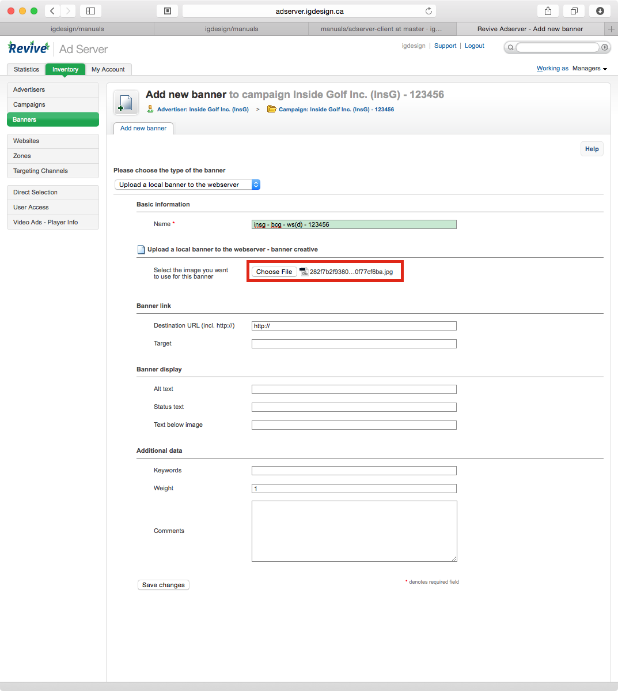

Adserver: New Banner/Updating Updating
=====================================

Created: 2014-11-04 - Gregory Daynes

### Introduction

This guide is focused on how to create and update a banner within a campaign

Requirements
[Adserver access](https://github.com/igdesign/manuals/tree/master/adserver-access)
[Adserver client](https://github.com/igdesign/manuals/tree/master/adserver-client)
[Adserver Campaign](https://github.com/igdesign/manuals/tree/master/adserver-campaign)

### Guide

1. Navigate to the desired campaign, and select add new banner on the campaign we just created [Fig.1]

2. Enter the short name of the company, the website that the ad will appear on, the size of the ad and what zones it will appear on, and then the contract number. [Fig.2] This allows us to quickly see what the banner is when looking at an exported list.

3. Click choose file, and select the creative to upload, by navigating to the folder and selecting it. [Fig.3] [Fig.4]
If using flash creative, a second "Choose File" button will appear and a static creative (Jpg, gif, png) will need to be selected. This is the fallback system for mobile devices, as well as email clients.

4. Enter the url in the url field. If the client has external tracking systems, the need to be part of the url entered. This is not a common request, but should be considered. [Fig.5]
Most clients will send a link to a landing page. __Make sure you use the link provided, and not after you've clicked on it. There are sometimes redirects that you will not notice, but the ad will not track on their end, creating a discrepency in stats__

5. Click save changes. All the other fields do not need to be adjusted. You can, but there is no need. Weighting can be adjusted if the banner needs to be weighted differently, but this is an outlier.

6. A notification banner in green will confirm that the banner has been saved [Fig.6]. click the banner link in the notification or in the list below to view the ad, as well as setup placement. 

7. you should now see a preview of your ad, as well as the size of the ad below in the width/height fields. [Fig.7] The next 

8. Click on linked zones [Fig.8]

9. The list of zones bellow allows you to select where the ad will appear [Fig.9]. This list is filtered off of two things
First: the zones chosen in the campaign setup
Second: the size of the ad. If the ad is a vertical banner, it will only appear in vertical banner sized spots.

10. Save any changes you made.

The ad should now be visible in the zones specified. If it isn't, the cache may need to be updated. There is a 5-10 window between refreshes. Go have a coffee, and come back.

If the ad is still not displaying, go back and check all the settings.