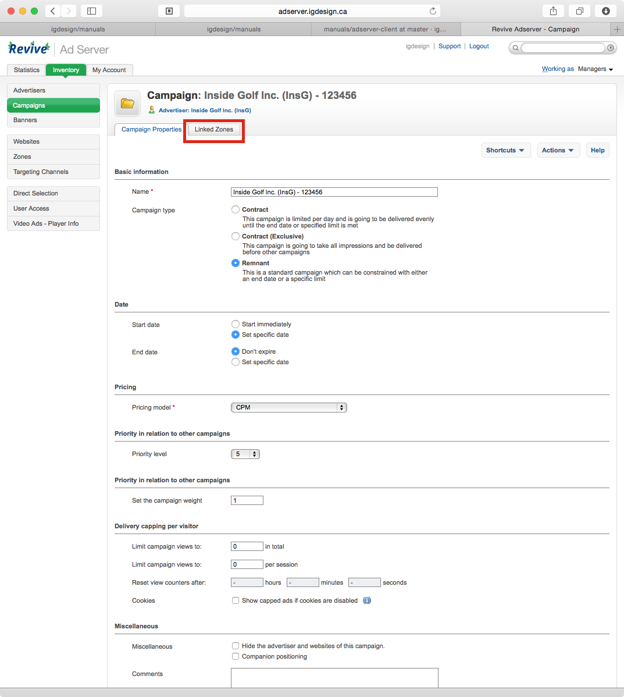

Adserver: New Campaign/Updating Campaign
=====================================

Created: 2014-11-03 - Gregory Daynes

### Introduction

This guide is focused on how to create and update campaign

Requirements
[Adserver access](https://github.com/igdesign/manuals/tree/master/adserver-access)
[Adserver client](https://github.com/igdesign/manuals/tree/master/adserver-client)

### Guide

1. Log into adserver - find advertiser you wish to use for new campaign or updating campaign [Fig.1]. If advertiser doesn't exist. Refer to [Adserver client](https://github.com/igdesign/manuals/tree/master/adserver-client) on how to create a new client

2. if creating a new campaign click Add new campaign [Fig.2]. If looking for an old campaign, or not sure if a campaign has been created, click Campaigns [Fig.3] and skip to step XXX

3. New Campaign [Fig.4]

4. add in descriptive text to the campaign name [Fig.5]. This is usually just the invoice/contract number. You may also add in the sites and sizes of the ads, but this is better left to the zones and banners inside the campaign.

5. Select Remnant campaign [Fig.6] and the settings will appear below

6. Set a specific date for the campaign to start. If future ad, select date for ad to start appearing. For ad to start today, select today. For ad with no start date, select today's date anyways. [Fig.7]

7. Enter CPM for per thousand ad. If ad based on tenancy, change CPM to tenancy under pricing model [Fig.8] (WCTA ads are tenancy based).
The formula for calculating CPM is
[ad cost] / (#number-of-impressions / 1000)
$295 for 30000 impressions
295 / (30000 / 1000) = 295 / 30 = $9.83 cpm

8. if the ad has a specific amount of impressions (99.9% of our contracts) uncheck "unlimited" [Fig.9] and enter the number of impressions on contract [Fig.10]

9. click save changes [Fix.11]

10. a confirmation notification will appear in green on the next page [Fig.12]

11. Click on the campaign name in the notification [Fig.13]

12. this will open the campaign again, click on linked zones [Fig.14]

13. This screen shows a list of all zones and websites connected to the ad campaign. [Fig.15]

14. Select the website (top level item) to select all zones inside the website. This will allow for a campaign to have multiple-different sized ads that can appear in a website. [Fig.16]
The click Link.

15. selected zones will be moved over to the right hand column [Fig.17]

16. Go back to the campaigns list for the client.

To add a new banner to the campaign, please see the guide [Adserver Banner](https://github.com/igdesign/manuals/tree/master/adserver-banner)