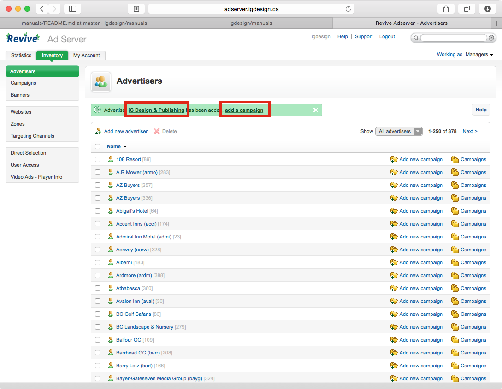

Adserver: New Advertiser/Updating Advertiser
============================================

Created: 2014-11-03 - Gregory Daynes

### Introduction

This guide is focused on how to create and update client information

Requirements
[Adserver access](https://github.com/igdesign/manuals/tree/master/adserver-access)

### Guide

1. Log into adserver - New advertiser go to step 2, edit advertiser, skip to step 5

2. New Advertiser: Click new advertiser [Fig.1]

3. Enter relevant information [Fig.2]
_note:_ emailing reports doesn't work currently.

4. click save. [Fig.3]

5. a green notification appears saying the client has been created. [Fig.4] From here you can add a campaign directly to client, or edit client id by clicking the name in the notification [Fig.5] or finding their name in the list and clicking it.

6. If updating, change relevant information and then click save changes.