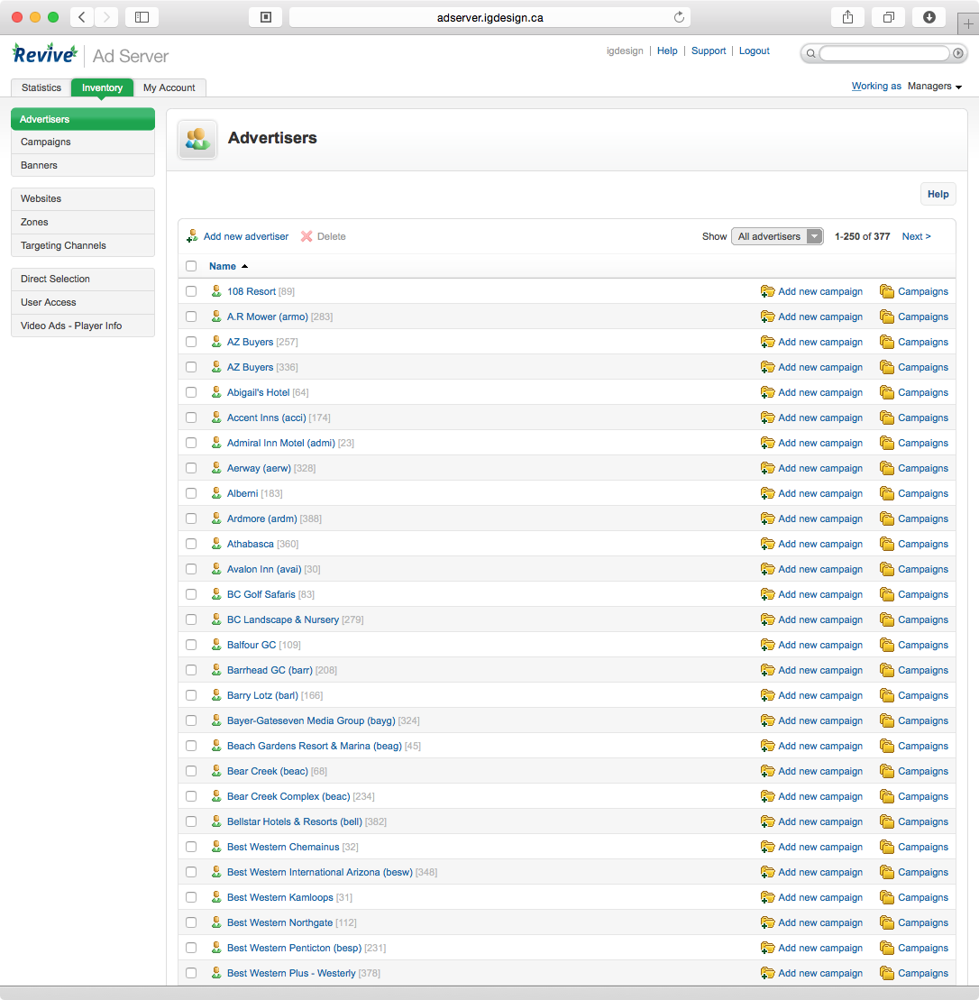
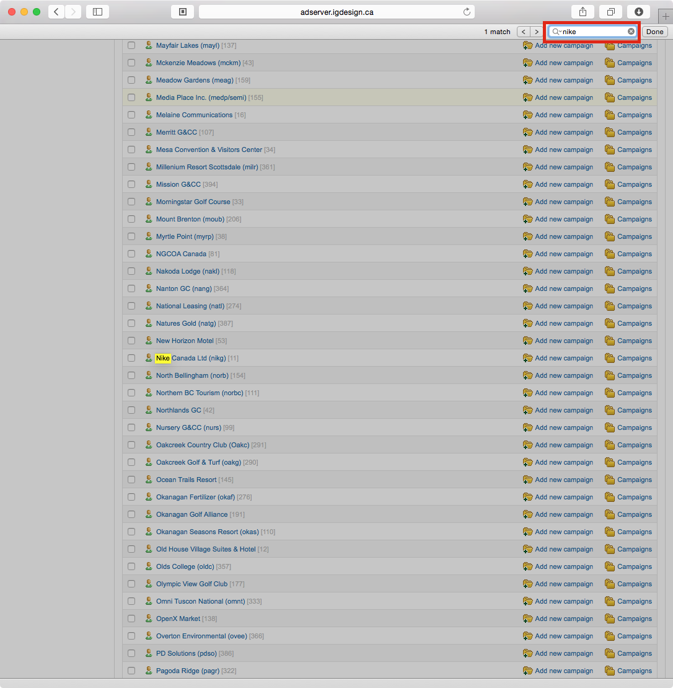
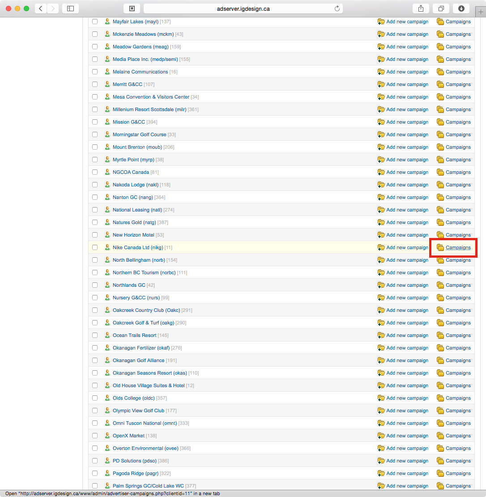
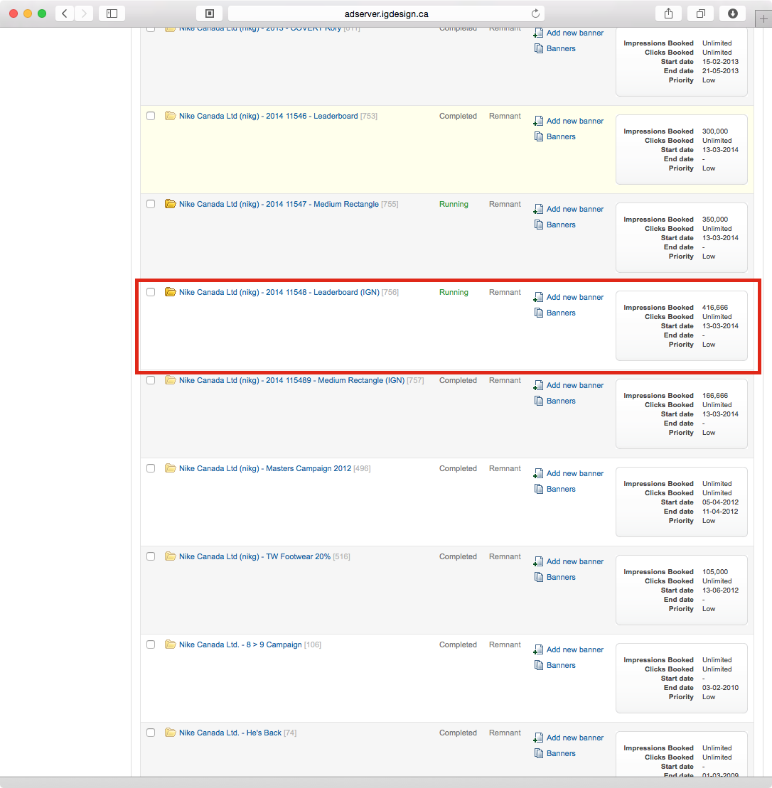
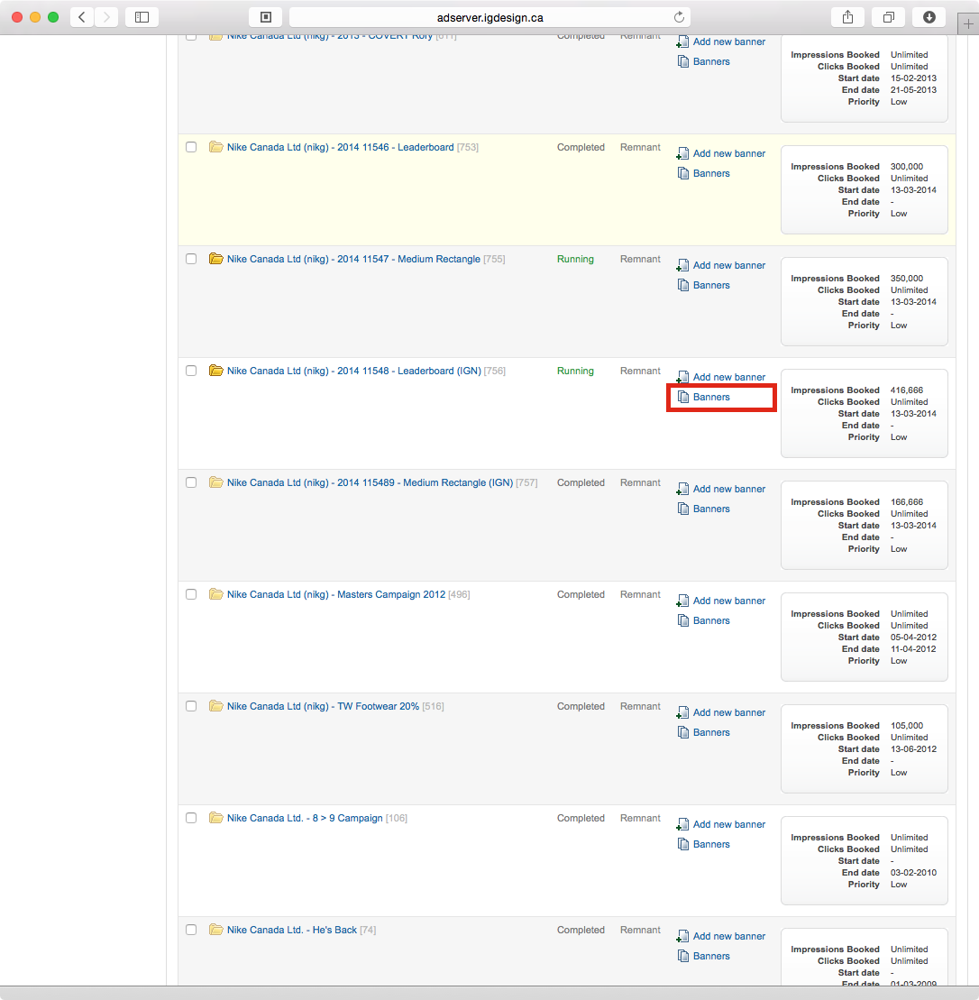
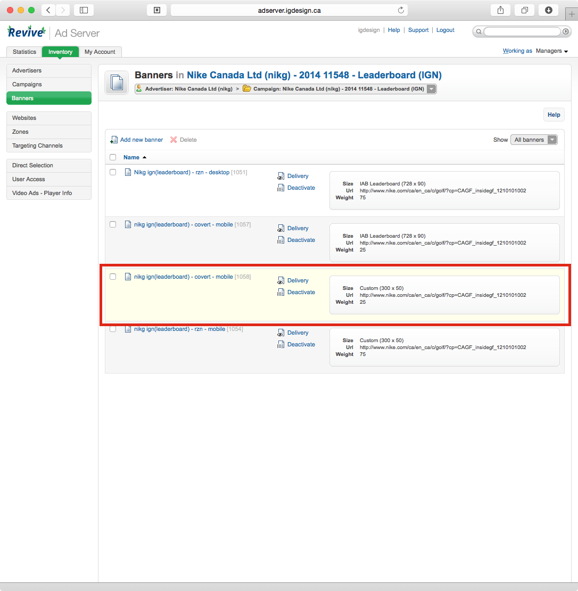
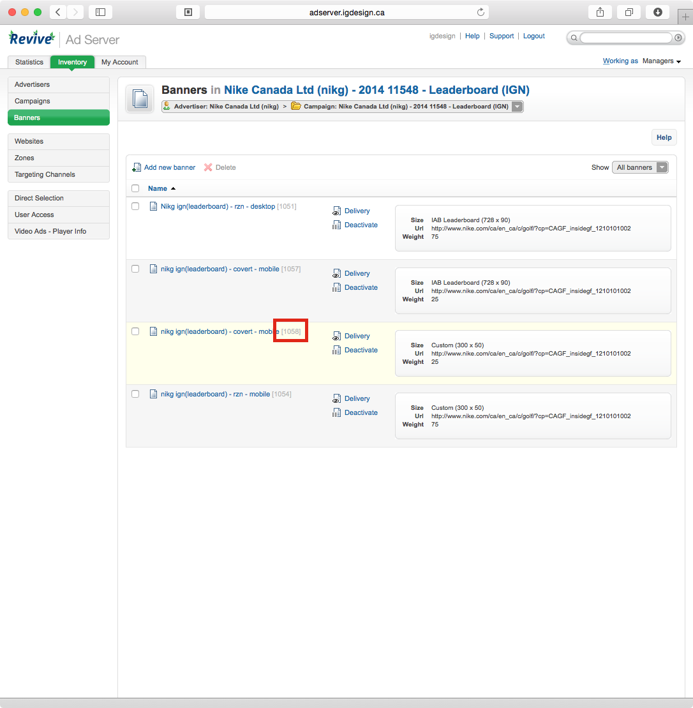

Adserver: Getting Banner ID in Revive
=====================================

Created: 2014-11-03 - Gregory Daynes

### Introduction

This guide is focused on how to retrieve the Banner ID of a specific ad, from Revive ad server.

Requirements
[Adserver access](https://github.com/igdesign/manuals/tree/master/adserver-access)

### Guide

1. Login to the adserver - once logged in, the list of all advertisers will be displayed [Fig.1]

2. Find the advertiser you're looking for. _The system only displays 250 advertisers per page_. Using ⌘-f to open search dialog, enter the name you're looking for. Eg: Nike [Fig.2]

3. Click on campaigns on the far right [Fig.3]

4. In the campaign list screen, find the campaign you are looking for (contract number, or name) [Fig.4]

5. Click Banners [Fig.5]

6. Locate the desired ad, using the information on the right, as well as the banner name [Fig.6]

7. Locate the Banner ID in the small grey text next to the banner name [Fig.7]

8. This is the banner id, use this number when placing ads inside newsletters or referencing specific banners

