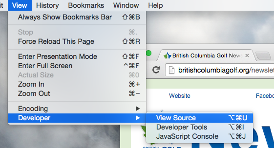

BCG Newsletter - Constant Contact
=================================

Created: 2014-11-04 - Gregory Daynes

### Introduction

This guide is to show how to get a ready to send newsletter from http://britishcolumbiagolf.org/newsletter into constant contact, and ready to send out to the mailing list.

This guide assumes the use of either Safari or Chrome web browsers, but will work in Firefox, Opera, Internet Explorer, and many of the lesser known browsers.

### Guide

1. Navigate to http://britishcolumbiagolf.org/newsletter in your preferred browser [Fig.1].

2. In your browser, find the option to view source. This is usually under a develop menu in the menu bar [Fig.2: Safari] [Fig.3: Chrome]. Alternatively, right clicking on the page will show a contextual menu, which _may_ have the View Source/Page Source button [Not in Chrome or Safari].

3. This will open up a developer window (or tool kit) that will show the source of the page [Fig.4]

4. click on the HTML source and select all ⌘-a [Fig.5] Then copy - edit->copy or ⌘-c

5. Navigate to http://constantcontact.com and select login [Fig.6]

6. Enter current log in information. This is in the 1password vault, but if the password is changed, Jim Lee is the contact for this. [Fig.7]

7. click on the Email tab in the top navigation [Fig.8]

8. click on "Create an Email" [Fig.9]

9. Click on the "Want to use your own code?" button at the bottom left [Fig.10]

10. Enter in an email name and click next [Fig.11]

11. make sure html is selected _either works, but html is selected by default_ then click next [Fig.12]

12. Select Advanced editor [Fig.13]

13. Select all of the text (don't leave any behind) in the large text area [Fig.14]. Use Select All (⌘-a) and then, if you haven't pressed  copy since step 4, you can press ⌘-v to paste in the code. It should look similar to [Fig.15]

14. Click on "Preview & Test" [Fig.16]

15. A new window will pop-up showing you a preview of the newsletter [Fig.17]. If you're happy with the preview, you can safely close the window __NOTE: If you have a pop up blocker installed, or no window appears, make sure you give the browser the ability to show popups for constant contact__

16. Now press save [Fig.18]. The newsletter is now ready to be sent out. Fill in the subject line, and follow the necessary steps for selecting the correct lists for the edition. This is usually done by Jim Lee from the BCG. Send him an email to tell him it's ready.

