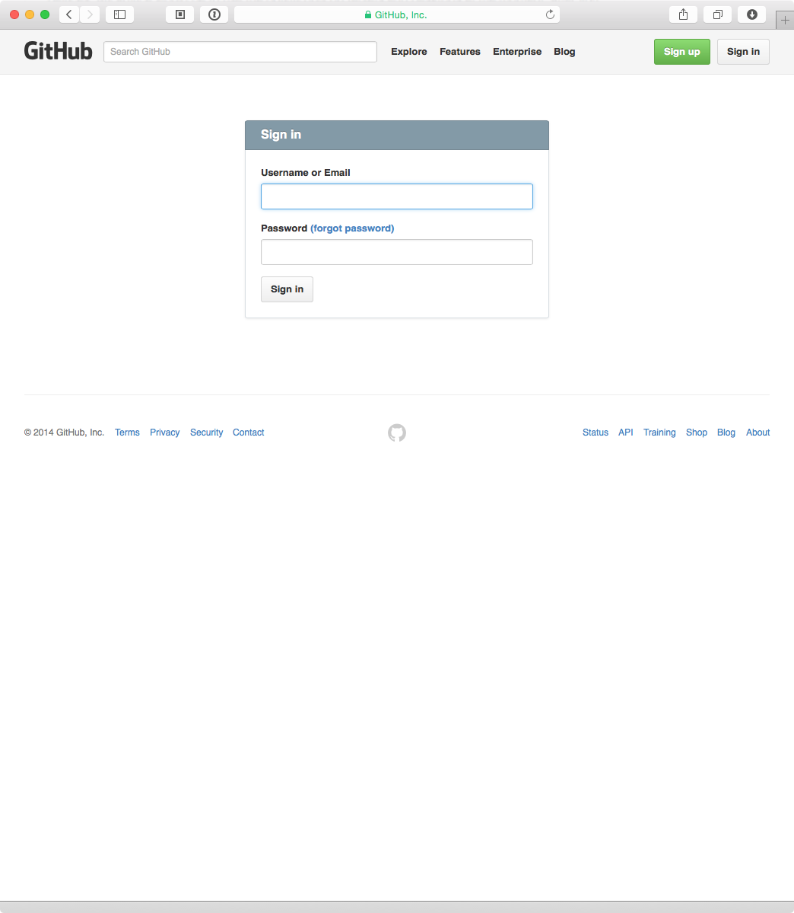
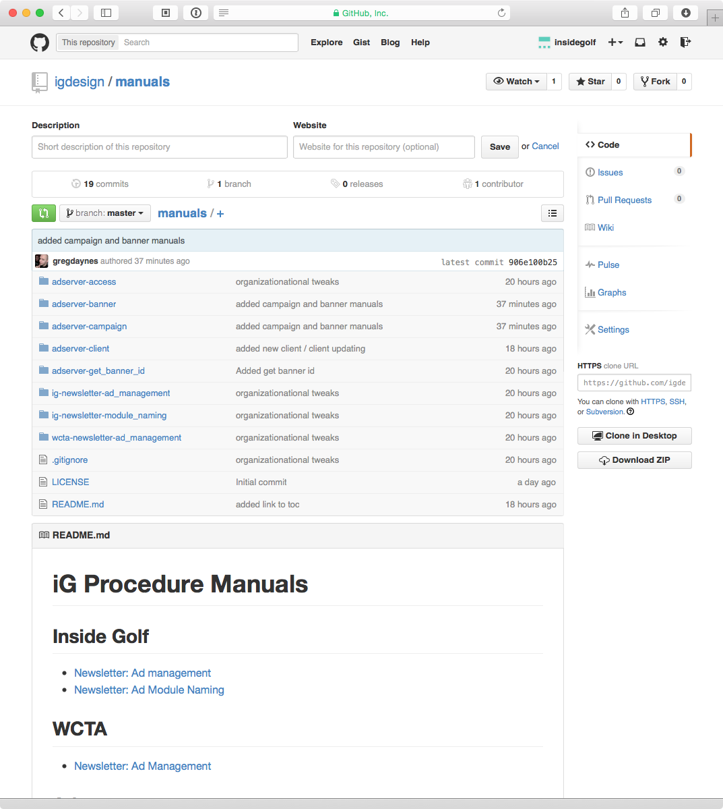
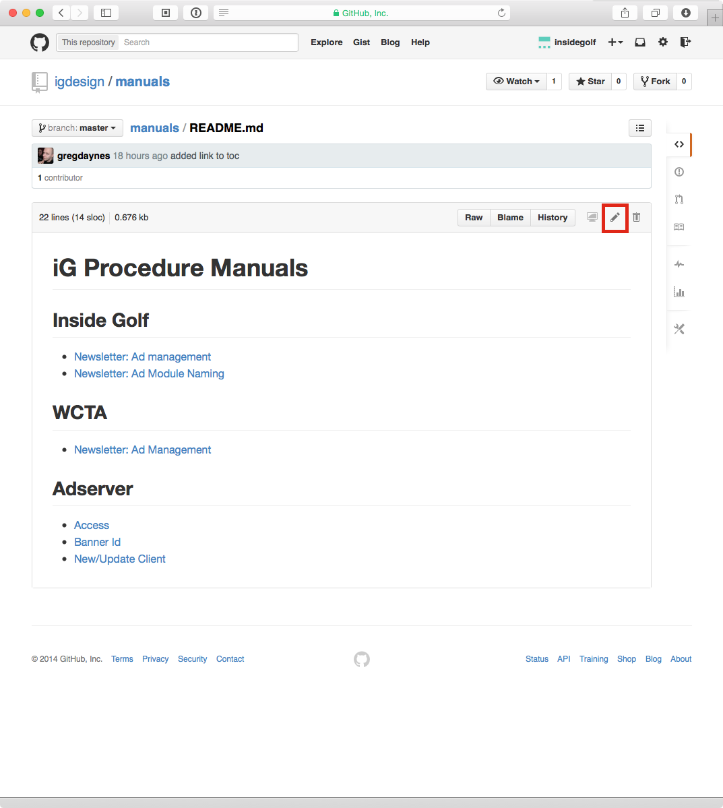
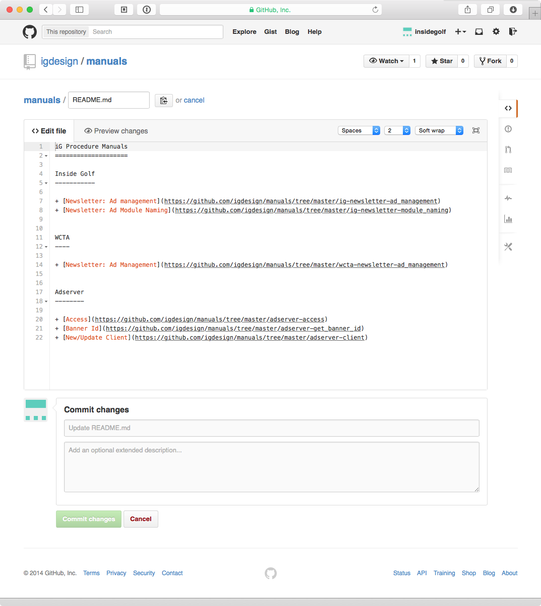
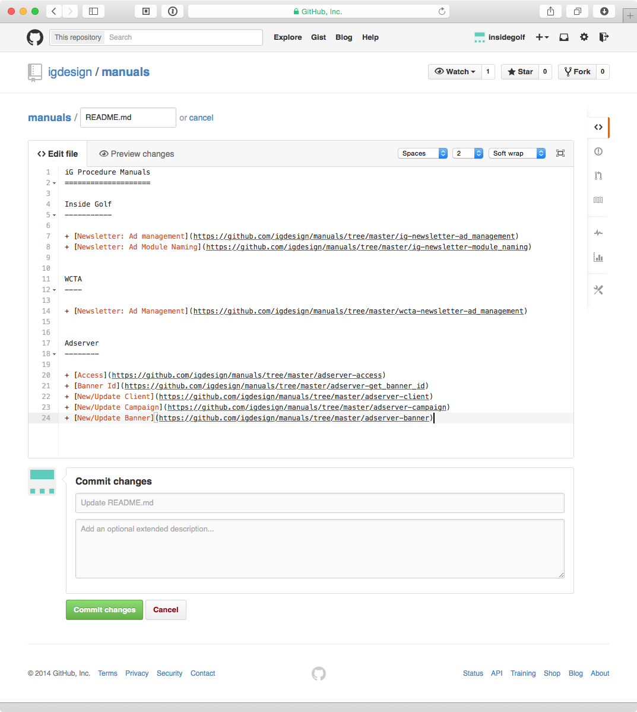
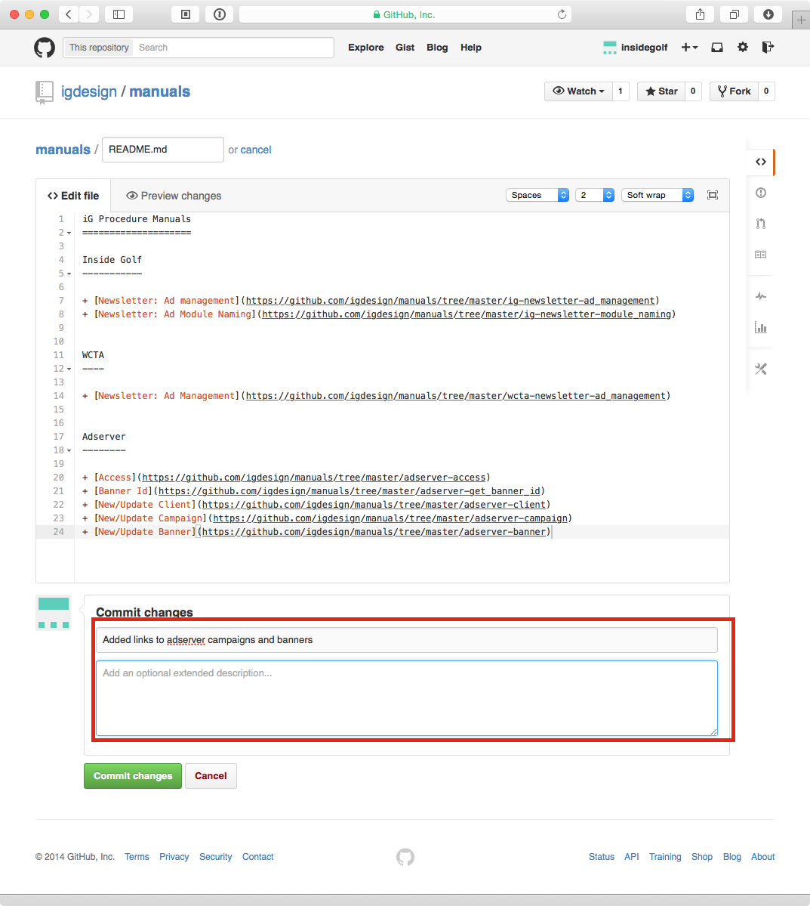
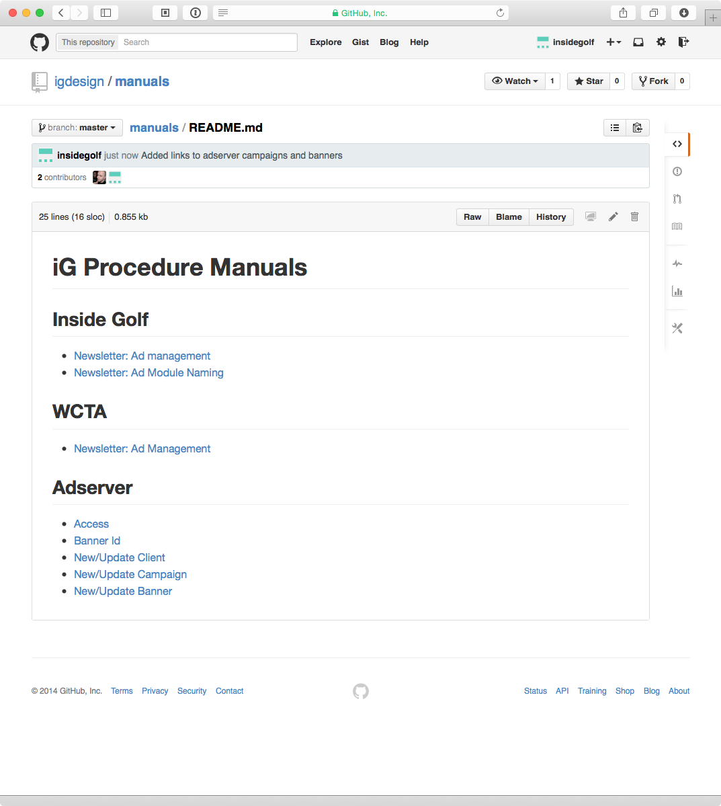

Github: Updating Manuals
========================

Created: 2014-11-04 - Gregory Daynes

### Introduction

This is a very basic guide to updating the manuals for iG Design. This is not a guide on how to use Git/Github [Lots of those on the internet]. This guide will also not cover how to add images, as that would require git. This will just be text changes.

### Guide

1. Navigate to Github.com and click login [Fig.1]

2. Enter in the username: insidegolf and the password can be found in the 1Password Vault [Fig.2]

3. Once successfully logged in, it is easier to navigate to http://github.com/igdesign/manuals than it is to click around.

4. Find the part of the manual you wish to edit in the folder structure. [Fig.3]
Each folder has a readme file (which contains the text for the text below the list of files) and a folder with figure images referenced in the guide. 
The structure is as follows
readme (table of contents)
adserver-access (folder)
- readme (markdown file)
- figures (folder)
- - figure_1.png... (image)

5. In this guide, we will update the table of contents. Click on the top level readme file. This will open up a view of just the file, and hide the file/folder list. [Fig.4] Click the pencil icon at the top to enter editing mode.

6. The document is written in Markdown Syntax. This allows for a processor to turn it into a nicely formatted document, while keeping it human readable. [Fig.5]

7. add in the new lines or make the corrections required, following the same syntax pattern as the other content. [Fig.6]

8. now add in a quick little note of the change made - this is required or you will not be able to save [Fig.7]

9. you should now see your changes guide [Fig.8]
