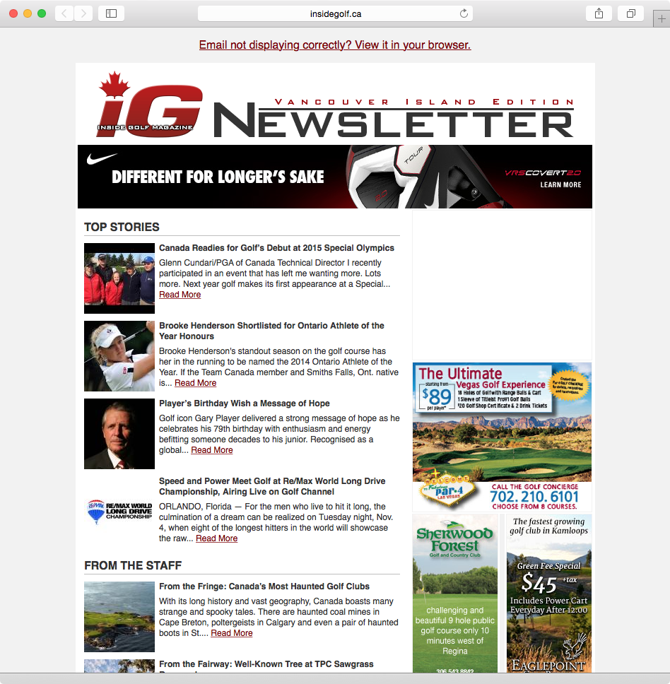
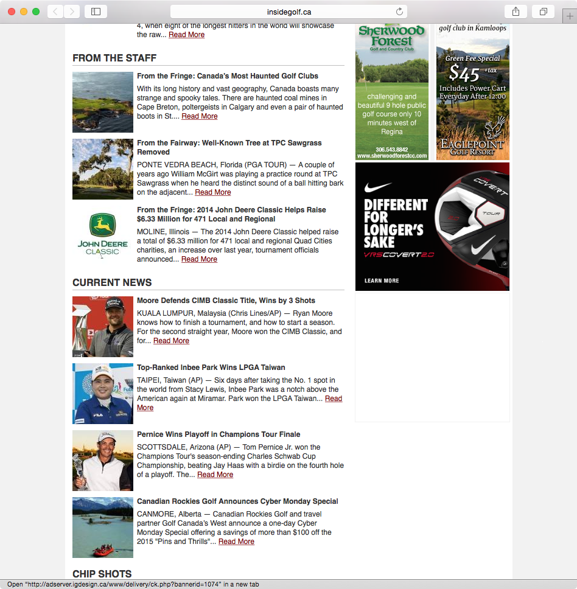
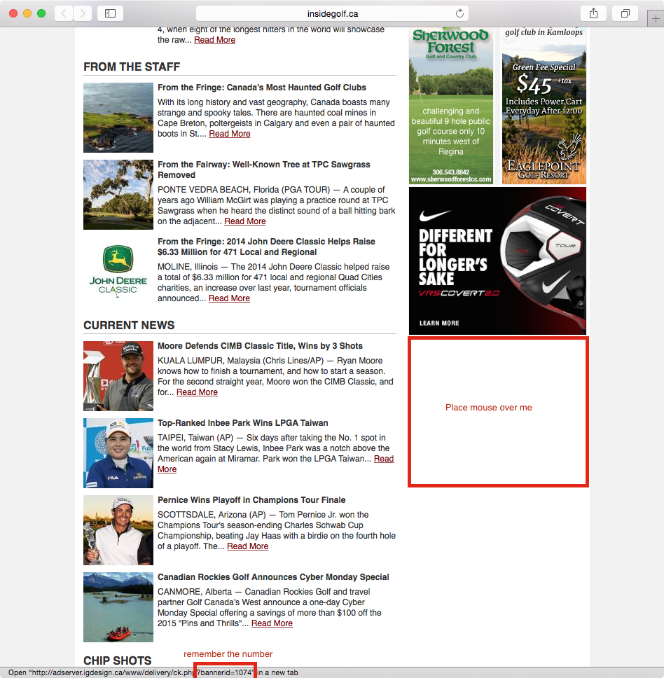

Inside Golf Newsletter: Ad Renewal Procedure
--------------------------------------------
Created: 2014-11-03 - Gregory Daynes

1. goto insidegolf.ca/newsletter

2. find the missing ad spaces (in this case, the top medium rectangle [figure_1] and the bottom medium rectangle [Figure 2])

3. place mouse over the missing ad block ![highlighted in red][figure_3]. The status bar will change and show a url with the text "bannerid=####" - remember this number. Eg: our screenshot shows  1074.

4. 

