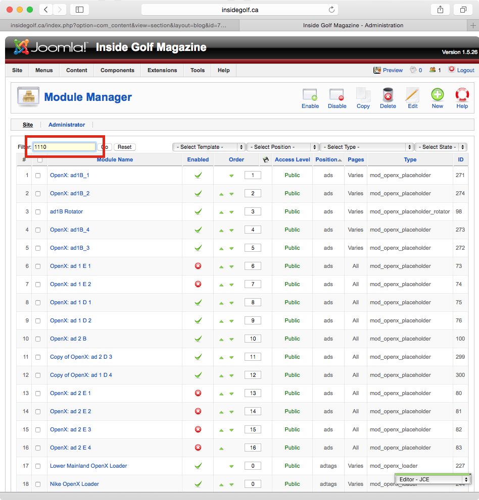
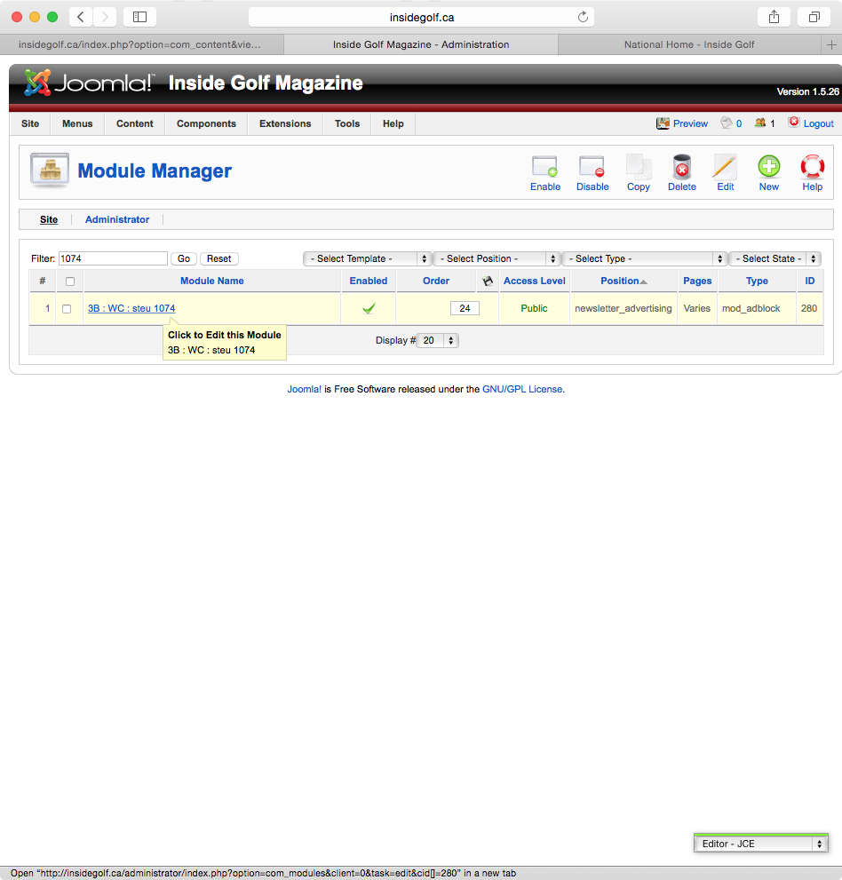
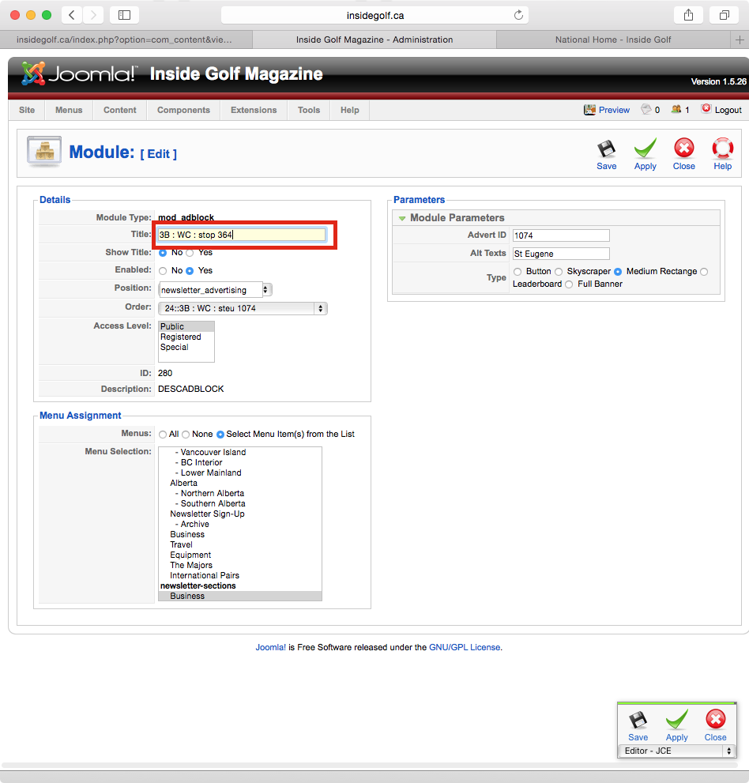
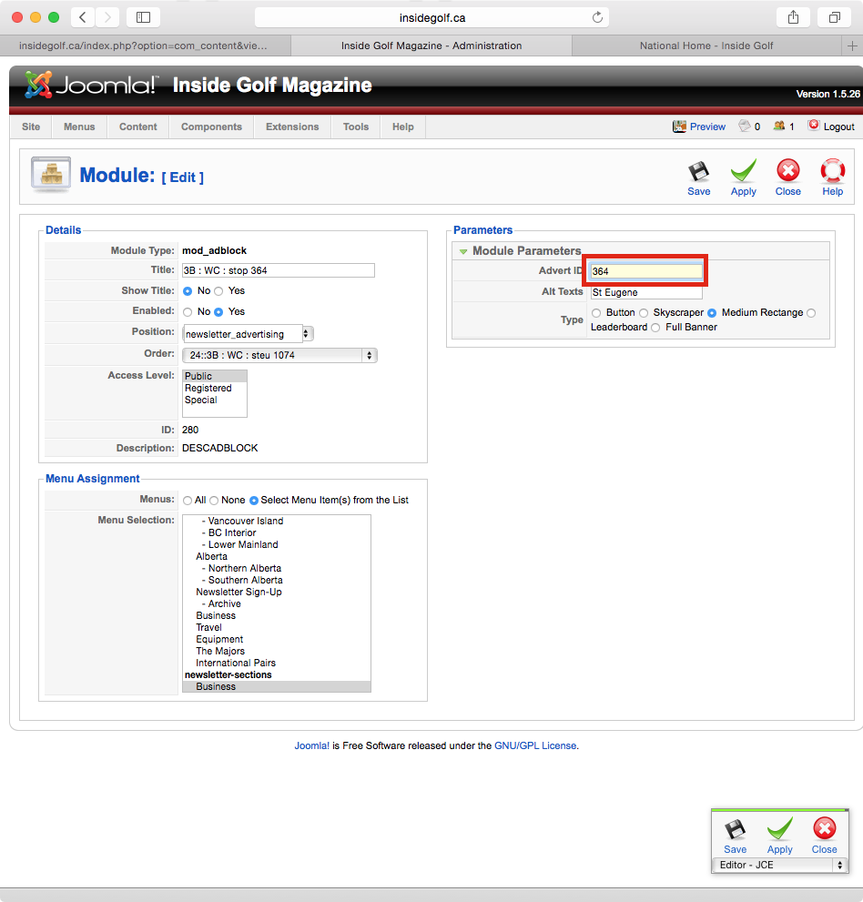
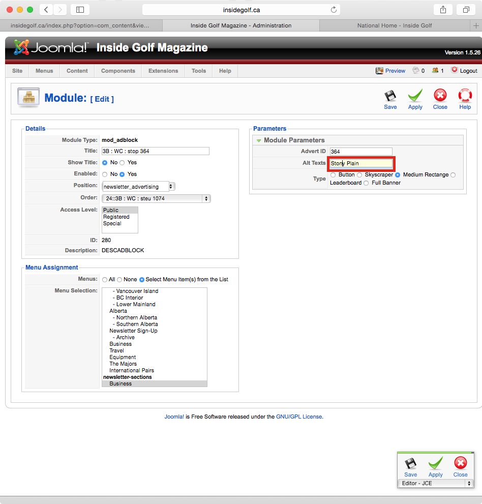
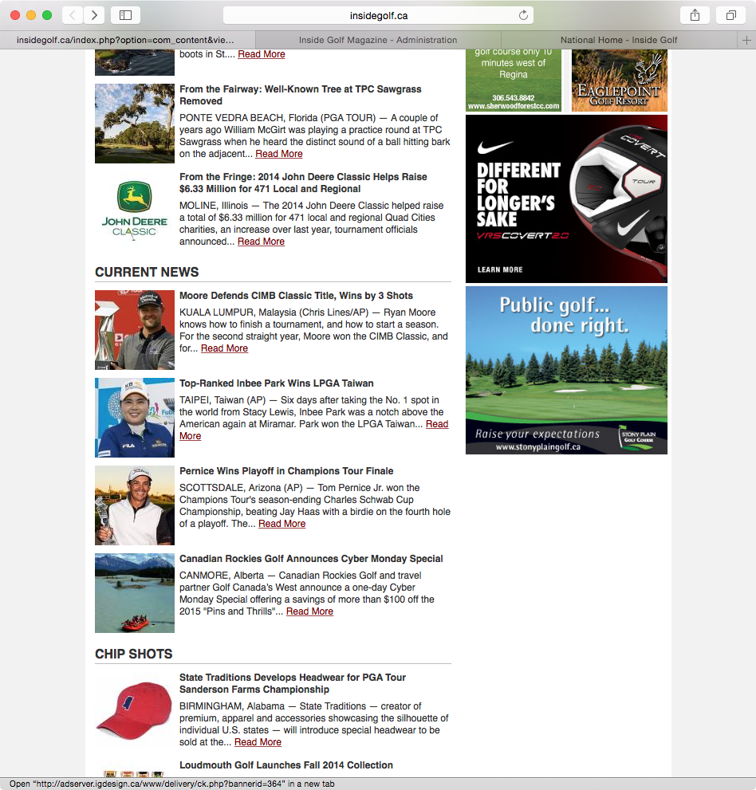

Inside Golf Newsletter: Ad Renewal Procedure
--------------------------------------------
Created: 2014-11-03 - Gregory Daynes

1. goto http://insidegolf.ca/newsletter

2. find the missing ad spaces (in this case, the top medium rectangle [Fig.1] and the bottom medium rectangle [Fig.2])

3. place mouse over the missing ad block [Fig.3: - Highlighted in red]. The status bar will change and show a url with the text "bannerid=####" - remember this number. Eg: our screenshot shows  1074.

4. Log in to http://insidegolf.ca/administrator

5. navigate to extensions/modules

6. using the filter, enter the bannerid you remember from step 3. [Fig.4] - press enter/return/go

7. the list of modules will return only the ones that include 1110 in the name. This is important for later. click on the title of the module [Fig.5]

8. open a new browser window and navigate to http://insidegolf.ca and find an ad to replace our existing ad. [Fig.6]
![Fig.6: insidegolf.ca - find like sized ad, get banner id from mousing over. __To find flash ad ID, you will need to go to adserver.igdesign.ca to find it__

9. Change the title of the module to reflect the new ad, following standard naming procedures, as well as the new ID - this allows for filtering to occur. Without this, tracking down the ad will be no fun. [Fig.7]. The other parts to the filename are explained at [module naming](http://github.com/igdesign.ca/manuals/iG_Module_Naming)

10. change the advert id on the right [fig.8]. this is just the bannerid from previous steps. NUMBER ONLY

11. change the alt texts to be the ad name. __If the ad is a skyscraper__: enter the first name followed by a comma then the second name. eg: "Stony Plain,Inglewood" - no quotes [Fig.9]

12. Go back to the newsletter front end and refresh. Check to see if the ad is in the correct position. [Fig.10]

