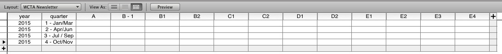
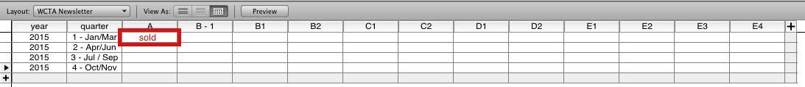
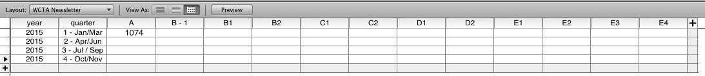
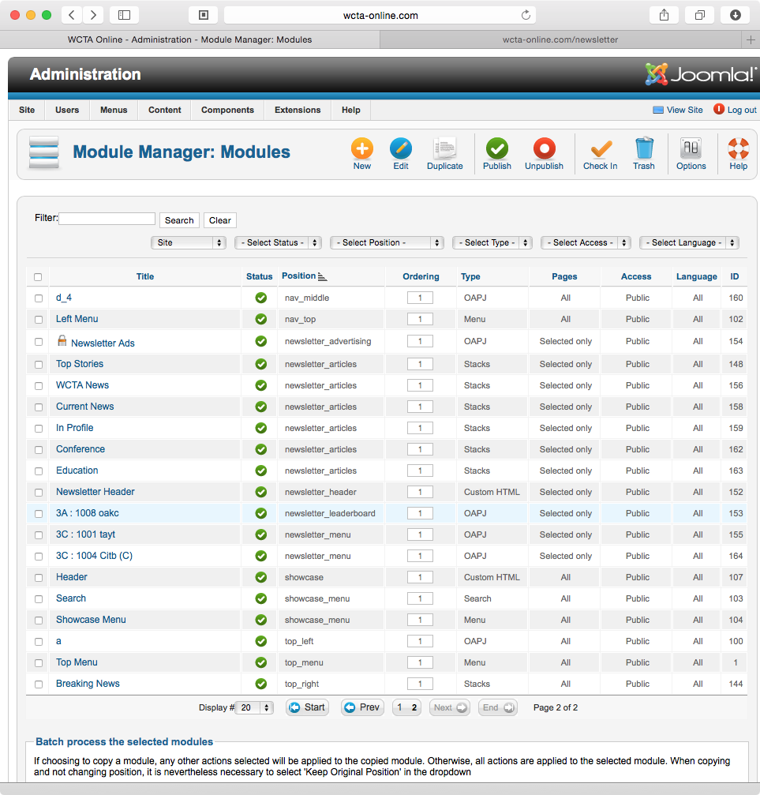
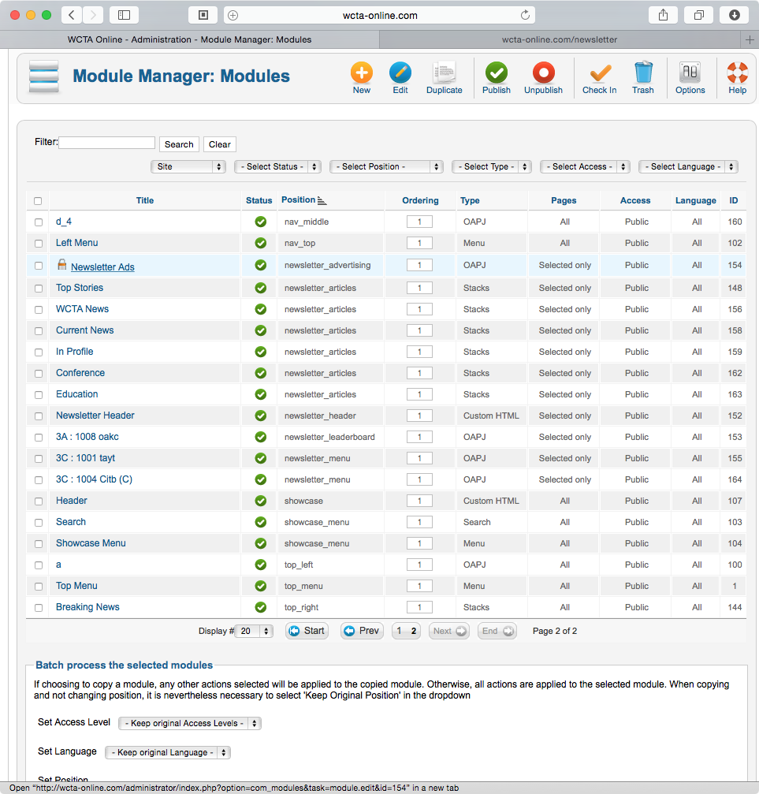
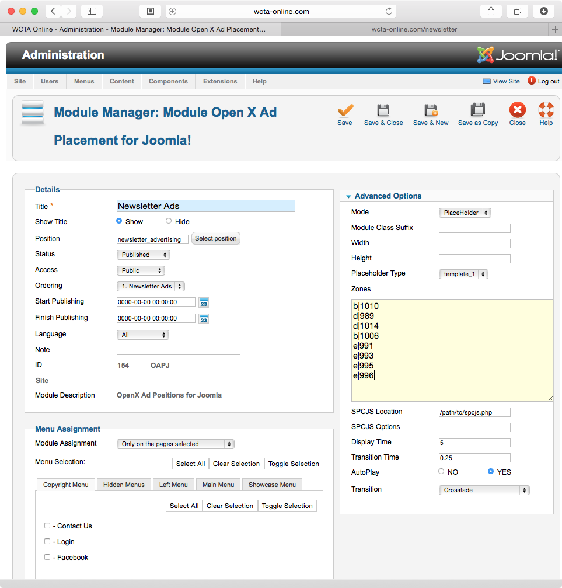
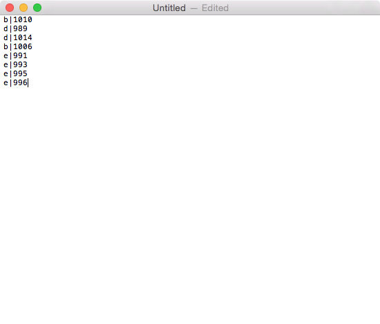
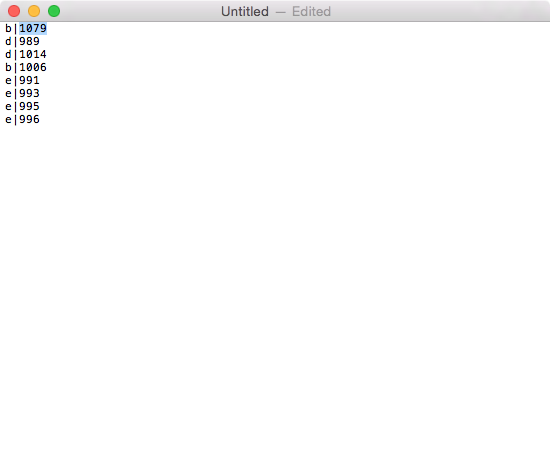

WCTA Newsletter: Ad Renewal Procedure
=====================================

Created: 2014-11-03 - Gregory Daynes

This guide assumes you know how to use revive adserver to get the banner id for a certain client + campaign. Please see [this guide](https://github.com/igdesign/manuals/tree/master/Adserver/Getting_Banner_ID)
As well as [naming modules](https://github.com/igdesign/manuals/tree/master/iG_Module_Naming)

### Information
The WCTA Newletter advertising is based on tenancy. This means it changes with time, and not with impressions. Ads are purchased for the year, starting January 1 and ending December 31.

When the sales team sells and ad, they have the option to place the add on the newsletter. Due to the tenancy, there are limited spots available. Each spot is available quarterly - 3 month periods.

The database that manages this is in Filemaker Pro - iGDP contracts - layout: WCTA newsletter.

### Sales Team
Upon selling a contract for the WCTA newsletter, the sales team need to indicate in the layout that the position has been sold - if they do not know the invoice number, typing the word "sold" in the position is good enough.

Filemaker Pro - iGDP contracts - layout: WCTA newsletter.

Production will go and update it as necessary [when they have the invoice number]

This layout, and process allows for the sales people to, at-a-glance, see what spots are available to sell while talking to the client.

### Updating Newsletter Procedure

1. Navigate to http://wcta-online.com/administrator

2. Then to extensions -> module manager [Fig.2]

3. There are 3 module types that will need to be edited. 3A for leaderboards (see inside golf newsletter managment for naming) 3C full banners (at the bottom) and Newsletter Ads (All ads on the right)

4. Leaderboard: To start editing the leaderboard, click on the module that starts with 3A. [Fig.3]

5. Now, change the 3 places highlighted in Red in [Fig.4] - The title should be changed to reflect the new banner id as well as the short named client name - please see [this guide](https://github.com/igdesign/manuals/tree/master/iG_Module_Naming) on how to name your module.
Change the Banner ID on the right to reflect the banner ID
as well, change the Alternative Text to be the clients full name.

6. Press save, and check the results by navigating to http://wcta-online/newsletter

7. Full Banners - follow steps 4-6 to update each (2x) of the full banners at the bottom of the newsletter

8. In the module manager list, click on Newsletter Ads [Fig.5]

9. The zones text area is the important part to this setup [Fig.6]

10. It's best to copy this text into an external text editor to be able to undo changes if a mistake is made [Fig.7]

11. Change the id numbers on the right hand side of the pipe "|" character to the right of the size.
Eg: If I am replacing the top medium rectangle, I would find the first instance of "b" and change the number beside it to the new banner id. [Fig.8]
__It is important that each line consists of "[size]|[banner_id]" and nothing else. no white space.__

13. Once you've updated all the banner id's with the changes, select all the text in your text edit file, and copy/paste it into the zones field [Fig.9]

14. Save your changes, and then navigate to http://wcta-online.com/newsletter to check your changes have been made correctly.
__If changes do not appear, check that you've saved correctly__
__if no ads appear, there is a syntax problem with your zones - go back, and check that each line has only "[size]|[banner_id]"__
